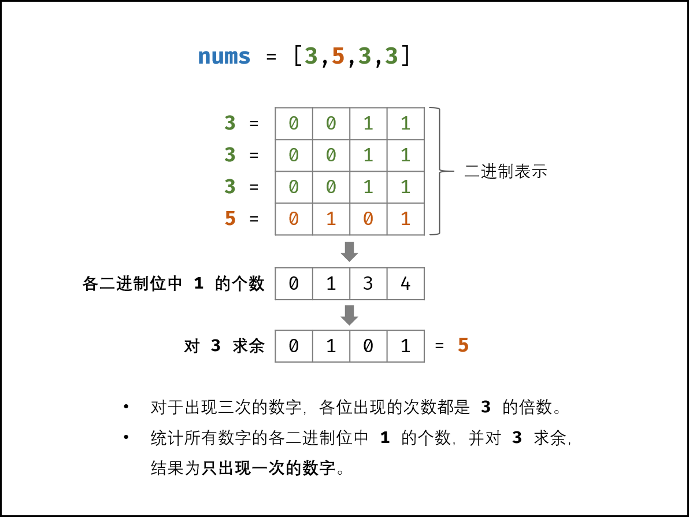

# leetcode-java
leetcode for java
## stack
栈常见的应用有进制转换，括号匹配，栈混洗，中缀表达式（用的很少），后缀表达式（逆波兰表达式）等。

## 树
树的重要性质：
如果树有 n 个顶点，那么其就有 n - 1 条边，这说明了树的顶点数和边数是同阶的。
任何一个节点到根节点存在唯一路径，路径的长度为节点所处的深度
实际使用的树有可能会更复杂，比如**使用在游戏中的碰撞检测可能会用到四叉树或者八叉树**。以及 k 维的树结构 k-d 树等。

